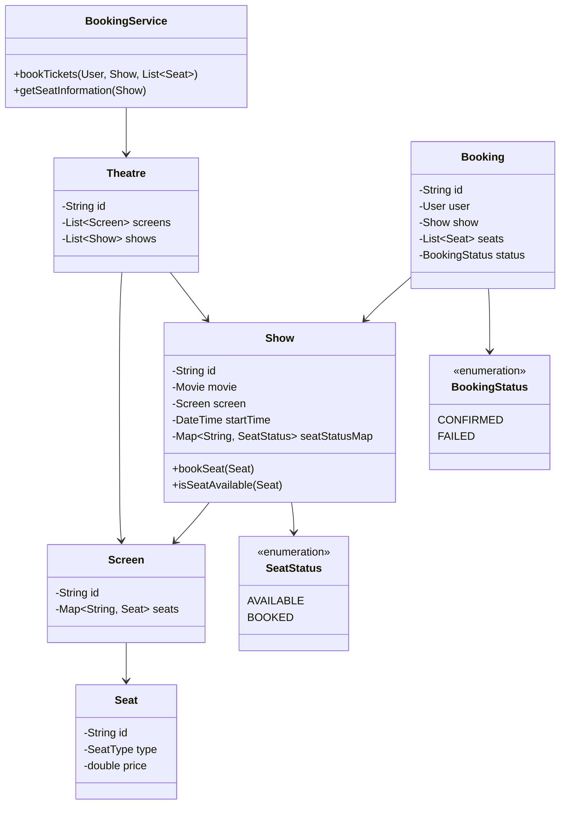
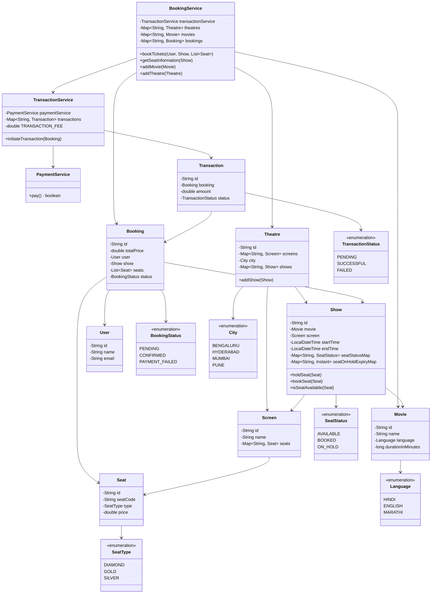

## BookMyShow

### Requirements

1. The system should allow users to view the list of movies playing in different theaters.
2. Users should be able to select a movie, theater, and show timing to book tickets.
3. The system should display the seating arrangement of the selected show and allow users to choose seats.
4. Users should be able to make payments and confirm their booking.
5. The system should handle concurrent bookings and ensure seat availability is updated in real-time.
6. The system should support different types of seats (e.g., normal, premium) and pricing.
7. The system should allow theater administrators to add, update, and remove movies, shows, and seating arrangements.
8. The system should be scalable to handle a large number of concurrent users and bookings.

### Class Diagram

#### Initial Simpler version


#### Comprehensive design


### Other considerations

1. Start Simple (First 5 minutes)
    * Draw just 4-5 core classes on the whiteboard
    * Basic models: Theatre, Movie, Show, Seat, Booking
    * One main service: BookingService
    * Ask interviewer: "I'll start with this basic design, and we can expand based on requirements"
2. Core Flow First (Next 30 minutes)
    * Implement basic seat booking first
    * Skip complex validations initially
    * Use simple collections (HashMap)
    * Basic error handling (just throw exceptions)
    * No concurrent handling yet
3. Minimum Viable Enums
    * Start with just 2 states (SUCCESS/FAILURE)
    * Don't create enums for every possible state
    * Example: Just AVAILABLE/BOOKED for seats
4. Follow-ups (Remaining time)
    * Wait for interviewer to ask about concurrency
    * Then add synchronized/locks where needed
    * Discuss potential improvements
    * Talk about what you would add in production
5. What to Skip Initially
    * Payment processing
    * Seat hold mechanism
    * User management
    * Complex state machines
    * Caching
    * Distributed systems concerns
6. Red Flags That You're Over-engineering
    * If you have more than 6-7 classes initially
    * If you're adding features without interviewer asking
    * If you're thinking about scalability before basic flow
    * If you're adding multiple services right away
7. Remember:
   * Get something working first
   * Add complexity only when asked
   * It's better to have a simple working solution than a complex incomplete one
   * You can always mention "In production, I would add..."

### Other Notes

Seat Lock - 
```java
public class Show {
    private final ConcurrentHashMap<String, SeatLock> seatLocks; // seat_id -> SeatLock
    
    private static class SeatLock {
        private final String lockId;  // booking ID or hold ID
        private final SeatStatus status;
        private final Instant expiryTime;
        
        public SeatLock(String lockId, SeatStatus status, Instant expiryTime) {
            this.lockId = lockId;
            this.status = status;
            this.expiryTime = expiryTime;
        }
    }

    public synchronized boolean tryHoldSeats(String bookingId, List<Seat> seats) {
        // First check if all seats are available
        for (Seat seat : seats) {
            if (!isSeatAvailable(seat.getId())) {
                return false;
            }
        }

        // Hold all seats with the bookingId
        Instant expiryTime = Instant.now().plusSeconds(HOLD_TIMEOUT_SECONDS);
        for (Seat seat : seats) {
            seatLocks.put(seat.getId(), 
                new SeatLock(bookingId, SeatStatus.ON_HOLD, expiryTime));
        }
        return true;
    }

    public void bookSeats(String bookingId, List<Seat> seats) {
        synchronized(this) {
            // Verify all seats are held by this booking
            for (Seat seat : seats) {
                SeatLock lock = seatLocks.get(seat.getId());
                if (lock == null || 
                    !lock.lockId.equals(bookingId) || 
                    !SeatStatus.ON_HOLD.equals(lock.status)) {
                    throw new BookingUnholdedSeatException(
                        "Seat " + seat.getId() + " is not held by this booking");
                }
            }
            
            // Book all seats
            for (Seat seat : seats) {
                seatLocks.put(seat.getId(), 
                    new SeatLock(bookingId, SeatStatus.BOOKED, null));
            }
        }
    }

    public void releaseSeats(String bookingId, List<Seat> seats) {
        synchronized(this) {
            for (Seat seat : seats) {
                SeatLock lock = seatLocks.get(seat.getId());
                // Only release if this booking holds the lock
                if (lock != null && lock.lockId.equals(bookingId) 
                    && SeatStatus.ON_HOLD.equals(lock.status)) {
                    seatLocks.remove(seat.getId());
                }
            }
        }
    }

    private boolean isSeatAvailable(String seatId) {
        SeatLock lock = seatLocks.get(seatId);
        if (lock == null) {
            return true;
        }
        
        if (SeatStatus.ON_HOLD.equals(lock.status)) {
            return lock.expiryTime.isBefore(Instant.now());
        }
        
        return false;
    }
}
```

Using AtomicReference - 
```java
public class Show {
    private final String id;
    private final Movie movie;
    private final Screen screen;
    private final LocalDateTime startTime;
    private final LocalDateTime endTime;
    // Key change: Using ConcurrentHashMap with AtomicReference for thread-safe updates
    private final ConcurrentHashMap<String, AtomicReference<SeatStatus>> seatStatusMap;
    
    public synchronized boolean tryHoldSeats(List<Seat> seats) {
        // First verify all seats are available
        for (Seat seat : seats) {
            AtomicReference<SeatStatus> statusRef = seatStatusMap.get(seat.getId());
            if (statusRef == null || !SeatStatus.AVAILABLE.equals(statusRef.get())) {
                return false;
            }
        }
        
        // If all available, hold them atomically
        for (Seat seat : seats) {
            seatStatusMap.get(seat.getId()).set(SeatStatus.ON_HOLD);
        }
        return true;
    }

    public void confirmBooking(List<Seat> seats) {
        synchronized(this) {
            // Verify all seats are on hold
            for (Seat seat : seats) {
                AtomicReference<SeatStatus> statusRef = seatStatusMap.get(seat.getId());
                if (!SeatStatus.ON_HOLD.equals(statusRef.get())) {
                    throw new BookingFailedException("Seat not on hold: " + seat.getId());
                }
            }
            
            // Book all seats
            for (Seat seat : seats) {
                seatStatusMap.get(seat.getId()).set(SeatStatus.BOOKED);
            }
        }
    }

    public void releaseSeats(List<Seat> seats) {
        for (Seat seat : seats) {
            AtomicReference<SeatStatus> statusRef = seatStatusMap.get(seat.getId());
            statusRef.compareAndSet(SeatStatus.ON_HOLD, SeatStatus.AVAILABLE);
        }
    }
}
```