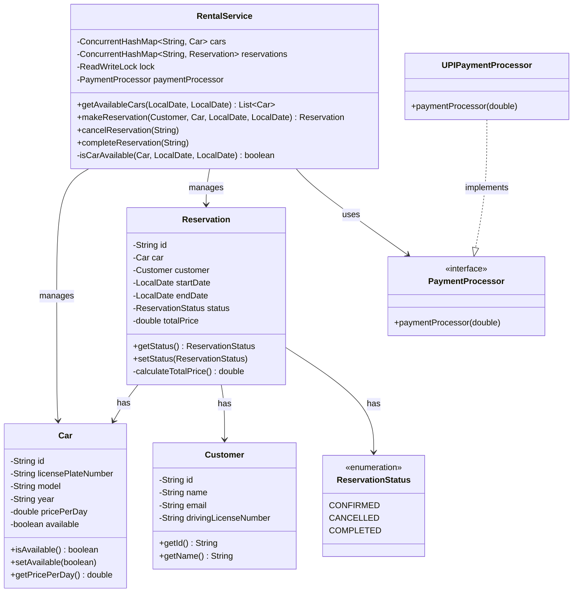

## Car Rental System

### Requirements

1. The car rental system should allow customers to browse and reserve available cars for specific dates.
2. Each car should have details such as make, model, year, license plate number, and rental price per day.
3. Customers should be able to search for cars based on various criteria, such as car type, price range, and availability.
4. The system should handle reservations, including creating, modifying, and canceling reservations.
5. The system should keep track of the availability of cars and update their status accordingly.
6. The system should handle customer information, including name, contact details, and driver's license information.
7. The system should handle payment processing for reservations.
8. The system should be able to handle concurrent reservations and ensure data consistency.

#### P0 Requirements:

1. Car management with basic details (make, model, year, price)
2. Basic customer information management
3. Car availability tracking (simple status management)
4. Basic reservation creation flow 
   1. Check car availability 
   2. Create reservation
   3. Update car status
5. Per-day reservations

#### P1 Requirements:

1. Search functionality for cars
2. Reservation cancellation
3. Payment processing basics (without actual gateway integration)
4. Per-hour reservations

#### P2 Requirements (Must be discussed at the end of interview):

1. Concurrent reservation handling
2. Complex search with multiple criteria
3. Modification of existing reservations

#### How to handle reservations and timeslots?:

In a 90-minute LLD interview, we need to carefully consider the time slot complexity. Let me break this down:
Simplest Approach (Recommended for initial P0)

Daily bookings only (midnight to midnight)
Store just start date and end date
Easy to implement and verify availability
Takes ~5-10 minutes to code

```java
class Reservation {
private LocalDate startDate;
private LocalDate endDate;
// other fields
}
```
Hourly Bookings (P1/P2)
If interviewer asks to support hourly bookings, here are two approaches:

Simple Time Slot Approach

```java
class Reservation {
private LocalDateTime startTime;
private LocalDateTime endTime;
// other fields
}
```

Pro: Simple to implement (~10-15 minutes)
Con: Harder to handle concurrent bookings


Time Slot Division Approach (More complex)

```java
class TimeSlot {
private LocalDateTime startTime;
private Duration duration; // typically 1 hour
private boolean isBooked;
}

class Car {
private List<TimeSlot> timeSlots;
// other fields

    public void generateTimeSlotsForMonth() {
        // Generate 24 slots per day
    }
}
```

Pro: Better for concurrent handling
Con: Takes 20-25 minutes to implement properly

My Recommendation for Interview:

Start with daily bookings in P0
Mention: "We're starting with daily bookings for simplicity, but the system can be extended to support hourly bookings"
If asked to implement hourly:

Use Simple Time Slot Approach if within first 45 minutes
Use Time Slot Division Approach if it's in the last 45 minutes and specifically asked about concurrency


Time Slot Edge Cases to Mention:

Timezone handling
Minimum booking duration
Maximum booking duration
Buffer time between bookings
Different rates for peak hours

Handle Questions Like:
"How would you handle timezone differences?"

"We can store all times in UTC and convert based on location"
"This becomes more important when we implement multi-location rentals"

Remember: In an interview, it's better to implement a simpler solution well than a complex solution poorly. You can always discuss how you'd enhance it for production use.


##### Additional Features to Consider:

1. Separate User for Customer and Admin
2. Location management - Pickup and drop
3. Maintenance and damage traction


### Class diagram



### Other considerations

Start With:
"For P0, I'll implement the core booking flow with:
1. Car management
2. Customer details
3. Basic reservation
4. Simple availability check"

ONLY IF ASKED, mention relevant follow-ups from those 8 points.
For example:
1. If interviewer asks "What about concurrent bookings?"
   1. Then discuss concurrency approach
2. If they ask "How would you handle payments?"
   1. Then discuss payment integration
3. If they ask "What other features would you add?"
   1. Then mention 2-3 key extensions

Don't:
1. Proactively list all possible features
2. Deep dive into complex scenarios unasked
3. Try to solve everything in first pass

Do:
1. Focus on clean P0 implementation
2. Let interviewer guide the complexity
3. Show you can think beyond P0 when asked

This way you:
1. Demonstrate focus
2. Show prioritization skills
3. Prove system thinking when needed
4. Manage time effectively

Other concurrency considerations - 
1. Optimistic vs Pessimistic locking
2. Transaction isolation levels
3. State pattern for reservations/vehicles if -> Interviewer asks how to handle complex booking lifecycle
