## Elevator System

### Requirements

1. The elevator system should consist of multiple elevators serving multiple floors.
2. Each elevator should have a capacity limit and should not exceed it.
3. Users should be able to request an elevator from any floor and choose if he wants to go up or down.
4. The elevator system should efficiently handle user requests and optimize the movement of elevators to minimize waiting time.
5. The system should prioritize requests based on the direction of travel and the proximity of the elevators to the requested floor.
6. The elevators should be able to handle multiple requests concurrently and process them in an optimal order.
7. The system should ensure thread safety and prevent race conditions when multiple threads interact with the elevators.

#### Requirement Clarification
1. How many floors and elevators? -> N.
2. Elevator door should only open when it is idle.
3. Elevator is capable of serving all the floors for simplicity, but shall be extensible.
4. We will have internal displays and external displays.
5. Support to add more elevators or take down existing elevators for maintenance.
6. Each elevator should support emergency actions.

### Class Diagram

```mermaid
classDiagram
    class Direction {
        <<enumeration>>
        UP
        DOWN
        IDLE
    }
    class ElevatorCarStatus {
        <<enumeration>>
        MOVING
        IDLE
        MAINTAINENCE
    }
    class ElevatorDoorAction {
        OPEN
        CLOSE
    }
    class ElevatorDoorStatus {
        <<enumeration>>
        OPEN
        CLOSE
        OPENING
        CLOSING
    }
    class WeightSensor {
        -currentWeight : double
        -maximumWeight : double
        +updateWeight(double newWeight)
        +isCompliant() : boolean
    }
    class ObstacleDetector {
        +isObstaclePresent() : boolean
    }
    class ElevatorDoor {
        -id : String
        -status : ElevatorDoorStatus
        -obstacleDetector : ObstacleDetector
        +performAction(ElevatorDoorAction action)
    }
    EmergencySystem o-- EmergencyAction
    class EmergencySystem {
        -emergencyActions : List<EmergencyAction>
        +executeEmergencyActions()
    }
    class EmergencyAction {
        <<interface>>
        +execute()
    }
    EmergencyAction <|-- PhoneCallEmergencyAction
    EmergencyAction <|-- ElevatorAlarmEmergencyAction
    class PhoneCallEmergencyAction { }
    class ElevatorAlarmEmergencyAction { }
    DisplayPanel <|-- ElevatorCarDisplayPanel
    DisplayPanel <|-- FloorDisplayPanel
    class DisplayPanel {
        <<abstract>>
        -id : String
        -currentMessage : String
        -isWorking : boolean
        +showMessage(String message)
        +clearDisplay()
    }
    class ElevatorCarDisplayPanel {
        -currentFloor : Floor
        -direction : Direction
        -isOverloaded : boolean
        +updateDisplay(Floor floor, Direction direction)
        +showOverloadWarning(boolean isOverloaded)
    }
    class FloorDisplayPanel {
        -currentFloor : Floor
        -direction : Direction
        +updateDisplay(Floor floor, Direction direction)
    }
    DisplayController o-- ElevatorCarDisplayPanel
    DisplayController o-- FloorDisplayPanel
    class DisplayController {
        -elevatorCarDisplayPanels : Map<ElevatorCar, ElevatorCarDisplayPanel>
        -floorDisplayPanels : Map<Floor, Map<ElevatorCar, ElevatorCarDisplayPanel>>
        +updateDisplays(ElevatorCar elevatorCar, Floor floor, Direction direction)
    }
    class ButtonPressedHandler {
        onElevatorCarButtonPressed(ElevatorCar elevatorCar, Floor destinationFloor)
        onElevatorFloorButtonPressed(Floor floor, Direction direction)
        onElevatorCarEmergencyButtonPressed(ElevatorCar elevatorCar)
    }
    class ButtonCommand {
        <<interface>>
        execute()
        undo()
    }
    ButtonCommand <|-- DestinationCommand
    class DestinationCommand {
        -floor : Floor
        -elevatorCar : ElevatorCar
    }
    class Button {
        <<abstract>>
        -id : String
        -name : String
        -isLit : boolean
        -command : ButtonCommand
        -illuminate()
        -dim()
        +press()
        +release()
        +setCommand()
    }
    Button <|-- ElevatorCarButton
    Button <|-- ElevatorCarEmergencyButton
    Button <|-- ElevatorFloorButton
    class ElevatorCarEmergencyButton {
        -emergencySystem : EmergencySystem
    }
    class ElevatorCarButton {
        -destinationFloor : Floor
    }
    class ElevatorFloorButton {
        -direction : Direction
    }
    class ElevatorCar {
        -id : String
        -name : String
        -display : ElevatorCarDisplayPanel
        -buttons : List<Button>
        -door : ElevatorDoor
        -destinationQueue : ConcurrentLinkedQueue<Floor>
        -dispatcher : ElevatorDestinationDispatcher
        -displayController : DisplayController
    }
    class PickupSchedulingStrategy {
        <<interface>>
        selectElevatorCar(List<ElevatorCar> elevatorCar, Floor floor, Direction direction)
    }
    PickupSchedulingStrategy <|-- NearestElevatorPickupSchedulingStrategy
    PickupSchedulingStrategy <|-- SameDirectionPickupSchedulingStrategy
    class NearestElevatorPickupSchedulingStrategy { }
    class SameDirectionPickupSchedulingStrategy { }
    class DestinationSchedulingStrategy {
        <<interface>>
        selectNextDestination(ElevatorCar elevatorCar)
    }
    DestinationSchedulingStrategy <|-- FCFSDestinationSchedulingStrategy
    DestinationSchedulingStrategy <|-- SSTFDestinationSchedulingStrategy
    DestinationSchedulingStrategy <|-- SCANDestinationSchedulingStrategy
    DestinationSchedulingStrategy <|-- LOOKDestinationSchedulingStrategy
    class FCFSDestinationSchedulingStrategy {}
    class SSTFDestinationSchedulingStrategy {}
    class SCANDestinationSchedulingStrategy {}
    class LOOKDestinationSchedulingStrategy {}
    class ElevatorPickupDispatcher {
        -pickupSchedulingStrategy : PickupSchedulingStrategy
        +handlePickupRequest(Floor pickupFloor, Direction direction)
    }
    class ElevatorDestinationDispatcher {
        -destinationScheduingStrategy : DestinationSchedulingStrategy
        +handleDestinationRequest(ElevatorCar elevatorCar, Floor destinationFloor)
    }
    class Floor {
        -id : String
        -name : String
        -buttons : List<Button> 
        -display : FloorDisplayPanel
        -serviceableElevatorCars : List<ElevatorCar>
        -restrictedElevatorCars : List<ElevatorCar>
        -elevatorPickupDispatcher : ElevatorPickupDispatcher
        -displayController : DisplayController
    }
    class Building {
        -id : String
        -name : String
        -floors : List<Floor>
    }
    class ElevatorService { // singleton
        -buildings : List<Building>
    }
```

### Other considerations