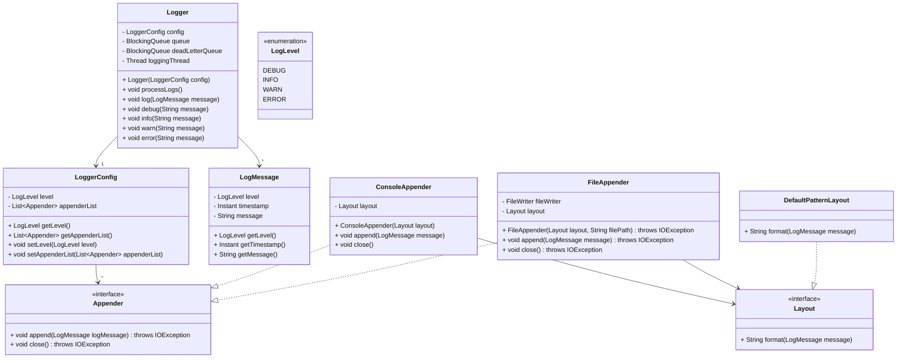

## Logging Framework

### Requirements

1. The logging framework should support different log levels, such as DEBUG, INFO, WARNING, ERROR, and FATAL.
2. It should allow logging messages with a timestamp, log level, and message content.
3. The framework should support multiple output destinations, such as console, file, and database.
4. It should provide a configuration mechanism to set the log level and output destination.
5. The logging framework should be thread-safe to handle concurrent logging from multiple threads.
6. It should be extensible to accommodate new log levels and output destinations in the future.

### Class Diagram

### Other considerations:

- How does the system handle high logging volumes?
    - Consider asynchronous logging, batching, and backpressure mechanisms.

- How do you ensure minimal performance impact on the application?
    - Use non-blocking or asynchronous appenders.

- What happens if the logging system itself fails or becomes slow?
    - Implement fallback mechanisms, such as dropping logs or switching to in-memory buffers.

- How do you structure log messages for better readability and parsing?
    - Use JSON or other structured formats for better integration with log aggregation tools.

- Can the log format be customized dynamically?
    - Provide configurable layouts to accommodate different output needs.

- How do you handle multi-line logs?
    - Ensure the system can process complex messages, stack traces, or JSON blobs.

- How are log levels configured?
    - Should they be adjustable at runtime (e.g., using a configuration file or admin interface)?

- Can different components of the system have different logging levels?
    - Allow fine-grained control of log levels per module or package.

- How is logging configuration reloaded dynamically?
    - Support hot reloading of logging configurations without restarting the application.

- How does the system integrate with log aggregation tools?
    - Examples: ELK Stack (Elasticsearch, Logstash, Kibana), Splunk, or CloudWatch.

- Can logs be forwarded to multiple destinations?
    - Support for multiple appenders (e.g., console, file, external monitoring systems).

- How do you ensure compatibility with industry-standard formats?
    - Support common logging protocols and formats, such as syslog, JSON, or OpenTelemetry.

- What happens when a log message cannot be written?
    - Implement retries, fail-over to alternative appenders, or discard the message gracefully.

- How do you handle exceptions during logging?
    - Ensure the logging system doesn’t crash the application if an exception occurs.

- How do you handle sensitive information in logs?
    - Mask or redact sensitive fields like passwords, PII, or credit card numbers.

- Is the logging system compliant with regulations?
    - Ensure compliance with GDPR, CCPA, or industry-specific standards like HIPAA.

- How do you secure log files and transmission?
    - Use encryption for log storage and secure transmission protocols (e.g., HTTPS, TLS).

- How do you add contextual information to logs?
    - Include request IDs, user IDs, or correlation IDs for debugging distributed systems.

- Can the system handle MDC (Mapped Diagnostic Context) or NDC (Nested Diagnostic Context)?
    - Useful for adding contextual information across thread boundaries.

- How do you manage log file rotation and retention?
    - Implement log rotation policies (e.g., size-based or time-based rotation) and archival strategies.

- How do you ensure logs don’t consume excessive storage?
    - Provide options for compression, deletion, or offloading to external storage.

- How do you test the logging system?
    - Use unit tests for log message formatting, integration tests for appenders, and load tests for performance.

- How do you validate that all critical events are logged?
    - Implement monitoring for missing logs or a checklist of expected events.

- Does the system support asynchronous logging?
    - Reduce performance bottlenecks during high throughput.

- Can the system handle distributed tracing?
    - Add support for correlating logs across services in a distributed architecture.

- How do you support multiple environments (e.g., dev, staging, production)?
    - Provide environment-specific logging configurations.

- How do you monitor the health of the logging system?
    - Include metrics for log writing latency, dropped messages, or storage usage.

- Can the system trigger alerts based on specific log patterns?
    - Integrate with monitoring tools to detect and act on critical issues.

- Can users plug in custom appenders or layouts?
    - Design an extensible interface for adding custom logging destinations or formats.

- Does the system support dynamic filtering?
    - Allow filtering out unnecessary logs based on severity, module, or context.
