## Parking Lot

### Requirements

### Class Diagram

```mermaid
classDiagram
    Vehicle <|-- Car : "Is"
    Vehicle <|-- Motorcycle : "Is"
    Vehicle <|-- Truck : "Is"
	class Vehicle {
        <<abstract>>
		+getLicensePlateNumber()
		+isElectric()
		+isHandicapped()
	}
	class Motorcycle {
		
	}
	class Car {
		
	}
	class Truck {
		
	}
    ParkingSpot o-- ParkingSpotType : "Has"
    ParkingSpot o-- Vehicle : "Has"
	class ParkingSpotType {
        <<enumeration>>
		MOTORCYCLE
		COMPACT
		LARGE
	}
	class ParkingSpot {
		-id : String
		-spotNumber : String
		-isActive : boolean
		-isAvailable : boolean
		-isElectricEnabled : boolean
		-isReservedForHandicapped : boolean
		-hourlyRate : double
		-type : ParkingSpotType
		+parkVehicle(Vehicle vehicle)
		+vacateSpot()
		-canAccomodate(Vehicle vehicle)
	}
    ParkingSpotManager o-- ParkingSpot : "Manages"
    ParkingFloor *-- ParkingSpotManager : "Contains"
    ParkingLot *-- ParkingFloor : "Contains"
    ParkingLot *-- EntranceGate : "Contains"
    ParkingLot *-- ExitGate : "Contains"
    ParkingLot *-- ParkingLotDetails : "Contains"
    ParkingLot o-- ParkingTicket : "Contains"
    ParkingLotDetails *-- Location : "Contains"
    Gate <|-- EntranceGate : "Is"
    Gate <|-- ExitGate : "Is"
	class Location {
		-streetAddress : String
		-city : String
		-state : String
		-zipcode : String
		-country : String
	}
	class ParkingLotDetails {
		-location : Location
		-name : String
		-contactNumber : String
	}
	class Gate {
        <<abstract>>
		-id : String
		-name : String
	}
	class EntranceGate {
		
	}
	class ExitGate {
		
	}
	class ParkingSpotManager {
		-parkingSpots : Set<ParkingSpot>
		-spotAllocationStrategy : SpotAllocationStrategy
		+assignSpot(EntranceGate gate, Vehicle vehicle) : ParkingSpot
		+freeSpot(ParkingSpot parkingSpot)
		+addParkingSpot(ParkingSpot parkingSpot)
		+removeParkingSpot(ParkingSpot parkingSpot)
	}
	class ParkingFloor {
		-id : String
		-parkingSpotManager : ParkingSpotManager
		-isActive : boolean
	}
    CashPaymentStrategy ..|> PaymentStrategy : Implements
    UpiPaymentStrategy ..|> PaymentStrategy : Implements
    DefaultSpotAllocationStrategy ..|> SpotAllocationStrategy : Implements
    NearestToEntranceSpotAllocationStrategy ..|> SpotAllocationStrategy : Implements
    ParkingTicket o-- Vehicle : "Has"
    ParkingTicket o-- ParkingSpot : "Has"
    ParkingTicket o-- EntranceGate : "Has"
    ParkingTicket o-- ExitGate : "Has"
	class ParkingTicket {
		-id : String
		-vehicle : Vehicle
		-parkingSpot : ParkingSpot
		-parkingFloor : ParkingFloor
		-entranceGate : EntranceGate
		-exitGate : ExitGate
		-entryTime : LocalDateTime
		-exitTime : LocalDateTime
	}
    ParkingRateStrategy <|-- HourlyParkingRateStrategy : "Is"
    class ParkingRateStrategy {
        <<interface>>
        +calculatePrice(LocalDateTime entryTime, LocalDateTime exitTime, ParkingSpot spot) : double
    }
    class HourlyParkingRateStrategy {

    }
    ParkingLot o-- ParkingRateStrategy : "Has"
	class ParkingLot {
		-id : String
		-parkingLotDetails : ParkingLotDetails
		-floors : List<ParkingFloor>
		-entranceGates : Map<String, EntranceGate>
		-exitGates : Map<String, ExitGate>
		-parkingTickets : Map<String, ParkingTicket>
		-isActive : boolean
		+addParkingFloor(ParkingFloor floor)
		+removeParkingFloor(ParkingFloor floor)
		+addEntranceGate(EntranceGate gate)
		+addExitGate(ExitGate gate)
		+removeEntranceGate(EntranceGate gate)
		+removeExitGate(ExitGate gate)
		+allocateSpotAndGenerateTicket(EntranceGate gate, Vehicle vehicle) : ParkingTicket
		+deallocateSpotAndProcessPayment(ExitGate gate, ParkingTicket parkingTicket) : ParkingTicket // or receipt

	}
	class PaymentStatus {
        <<enumeration>>
		PROCESSING
		FAILED
		COMPLETED
	}
	class PaymentStrategy {
        <<interface>>
		+processPayment(double amount) : PaymentStatus
	}
	class CashPaymentStrategy {
		+processPayment(double amount) : PaymentStatus
	}
	class UpiPaymentStrategy {
		+processPayment(double amount) : PaymentStatus
	}
	class SpotAllocationStrategy {
        <<interface>>
		+findAvailableSpot(Vehicle vehicle, Set<ParkingSpot> parkingSpots, EntranceGate entranceGate) : ParkingSpot
	}
	class DefaultSpotAllocationStrategy {
		+findAvailableSpot(Vehicle vehicle, Set<ParkingSpot> parkingSpots, EntranceGate entranceGate) : ParkingSpot
	}
	class NearestToEntranceSpotAllocationStrategy {
		+findAvailableSpot(Vehicle vehicle, Set<ParkingSpot> parkingSpots, EntranceGate entranceGate) : ParkingSpot
	}
    ParkingLotService o-- ParkingLot : "Has"
	class ParkingLotService {
		-parkingLots : Map<String, ParkingLot>
		-instance : ParkingLotService
		+getInstance : ParkingLotService // synchronized
		+addParkingLot(ParkingLot parkingLot)
		+removeParkingLot(ParkingLot parkingLot)
		+generateTicket(ParkingLot parkingLot, EntranceGate entranceGate, Vehicle vehicle)
		+exitVehicle(ParkingLot parkingLot, ExitGate exitGate, ParkingTicket parkingTicket, PaymentStrategy paymentStrategy) : ParkingTicket // or receipt
	}
    class TransactionType {
        <<enumeration>>
        PARKING_PAYMENT,
        REFUND
    }
    class TransactionStatus {
        <<enumeration>>
        INITIATED
        PROCESSING
        COMPLETED
        FAILED
        REFUNDED
        CANCELLED
    }
    class Transaction {
        -id : String
        -type : TransactionType
        -ticket : ParkingTicket
        -amount : double
        -status : TransactionStatus
        -paymentMethod : PaymentStrategy
        -transactionTime : LocalDateTime
        -referenceId : String // payment gateway reference id
        -metadata : Map<String, String> // additional metadata
    }
    class TransactionRepository {
        +save(Transaction transaction)
    }
    class TransactionService {
        -transactionRepository : TransactionRepository
        -paymentGatewayService : PaymentGatewayService
        +processPayment(double amount, ParkingTicket ticket, PaymentStrategy paymentStrategy)
    }
    class PaymentGatewayService {
        +processPayment(double amount, PaymentStrategy paymentStrategy)
    }
    Transaction o-- TransactionStatus : "Has"
    Transaction o-- TransactionType : "Has"
    TransactionService o-- TransactionRepository : "Has"
    TransactionService o-- PaymentGatewayService : "Has"
```

### Other considerations:
1. Exception handling for - ParkingLotFull, TransactionFailure, etc.
2. Auditing - Adding auditing for vehicles entering and leaving the facility.
3. Instead of hard deleting the entities we should soft delete, using (isActive and deactivatedAt)
4. Events/Observers for system notifications
5. Validation layer for central validation
6. Monitoring and metrics capabilities

Summary of When to Use Factory in Your Design:
Vehicle Creation: Use Factory to create different vehicle types based on user input or configuration.
Parking Spot Creation: Use Factory to create different types of parking spots depending on the type of vehicle.
Payment Gateway Selection: Use Factory to instantiate different payment strategies based on user selection.
Gate Creation: Use Factory to create entrance and exit gates based on specific gate types.

When to use Object references or the Id of Objects ?

Use references when objects are closely related and need to interact frequently.
Use IDs when dealing with persistence, large data volumes, or when loose coupling is required.