## Parking Lot

### Requirements

### Class Diagram

```mermaid
classDiagram
    Vehicle <|-- Car : "Is"
    Vehicle <|-- Motorcycle : "Is"
    Vehicle <|-- Truck : "Is"
	class Vehicle {
        <<abstract>>
		+getLicensePlateNumber()
		+isElectric()
		+isHandicapped()
	}
	class Motorcycle {
		
	}
	class Car {
		
	}
	class Truck {
		
	}
    ParkingSpot o-- ParkingSpotType
    ParkingSpot o-- Vehicle
	class ParkingSpotType {
        <<enumeration>>
		MOTORCYCLE
		COMPACT
		LARGE
	}
	class ParkingSpot {
		-id : String
		-spotNumber : String
		-isActive : boolean
		-isAvailable : boolean
		-isElectricEnabled : boolean
		-isReservedForHandicapped : boolean
		-hourlyRate : double
		-type : ParkingSpotType
		+parkVehicle(Vehicle vehicle)
		+vacateSpot()
		-canAccomodate(Vehicle vehicle)
	}
	class Location {
		-streetAddress : String
		-city : String
		-state : String
		-zipcode : String
		-country : String
	}
    ParkingLotDetails *-- Location
	class ParkingLotDetails {
		-location : Location
		-name : String
		-contactNumber : String
	}
    Gate <|-- EntranceGate
    Gate <|-- ExitGate
	class Gate {
        <<abstract>>
		-id : String
		-name : String
	}
	class EntranceGate {
		
	}
	class ExitGate {
		
	}
    ParkingSpotManager o-- ParkingSpot
	class ParkingSpotManager {
	    // We can fetch the parking spots from a repository
		-parkingSpots : Set<ParkingSpot>
		-spotAllocationStrategy : SpotAllocationStrategy
		+assignSpot(EntranceGate gate, Vehicle vehicle) : ParkingSpot
		+freeSpot(ParkingSpot parkingSpot)
		+addParkingSpot(ParkingSpot parkingSpot)
		+removeParkingSpot(ParkingSpot parkingSpot)
	}
    ParkingFloor *-- ParkingSpotManager
	class ParkingFloor {
		-id : String
		-parkingSpotManager : ParkingSpotManager
		-isActive : boolean
	}
    DefaultSpotAllocationStrategy ..|> SpotAllocationStrategy : Implements
    NearestToEntranceSpotAllocationStrategy ..|> SpotAllocationStrategy : Implements
    ParkingTicket o-- Vehicle : "Has"
    ParkingTicket o-- ParkingSpot : "Has"
    ParkingTicket o-- EntranceGate : "Has"
    ParkingTicket o-- ExitGate : "Has"
    ParkingTicket *-- ParkingTicketStatus : "Has"
    class ParkingTicketStatus {
        <<enumeration>>
        ACTIVE,
        PAID
    }
	class ParkingTicket {
		-id : String
		-vehicle : Vehicle
		-parkingSpot : ParkingSpot
		-parkingFloor : ParkingFloor
		-entranceGate : EntranceGate
		-exitGate : ExitGate
		-entryTime : LocalDateTime
		-exitTime : LocalDateTime
		-status : ParkingTicketStatus
	}
    ParkingRateStrategy <|-- HourlyParkingRateStrategy : "Is"
    class ParkingRateStrategy {
        <<interface>>
        +calculatePrice(LocalDateTime entryTime, LocalDateTime exitTime, ParkingSpot spot) : double
    }
    class HourlyParkingRateStrategy {

    }
    ParkingLot o-- ParkingRateStrategy : "Has"
    ParkingLot *-- ParkingFloor
    ParkingLot *-- EntranceGate
    ParkingLot *-- ExitGate
    ParkingLot *-- ParkingLotDetails
    ParkingLot o-- ParkingTicket
    ParkingLot o-- TransactionService
	class ParkingLot {
		-id : String
		-parkingLotDetails : ParkingLotDetails
		-floors : List<ParkingFloor>
		-entranceGates : Map<String, EntranceGate>
		-exitGates : Map<String, ExitGate>
		-parkingTickets : Map<String, ParkingTicket>
		-isActive : boolean
		-transactionService : TransactionService
		+addParkingFloor(ParkingFloor floor)
		+removeParkingFloor(ParkingFloor floor)
		+addEntranceGate(EntranceGate gate)
		+addExitGate(ExitGate gate)
		+removeEntranceGate(EntranceGate gate)
		+removeExitGate(ExitGate gate)
		+allocateSpotAndGenerateTicket(EntranceGate gate, Vehicle vehicle) : ParkingTicket
		+deallocateSpotAndProcessPayment(ExitGate gate, ParkingTicket parkingTicket) : ParkingReceipt
	}
	class PaymentStatus {
        <<enumeration>>
		PROCESSING
		FAILED
		COMPLETED
	}
	class PaymentMethod {
	    <<enumeration>>
	    CASH
	    CARD
	    UPI
    }
    CashPaymentStrategy ..|> PaymentStrategy : Implements
    UpiPaymentStrategy ..|> PaymentStrategy : Implements
	class PaymentStrategy {
        <<interface>>
		+processPayment(double amount) : PaymentStatus
	}
	class CashPaymentStrategy {
		+processPayment(double amount) : PaymentStatus
	}
	class UpiPaymentStrategy {
		+processPayment(double amount) : PaymentStatus
	}
	class CreditCardPaymentStrategy {
        +processPayment(double amount) : PaymentStatus
    }
	class PaymentStrategyFactory {
	    // Why do you need factory here? 
	    //   You might want to set additional configuration of the payment strategies
	    //   e.g. client creation, client setup, etc.
	    +createPaymentStrategy(PaymentMethod PaymentMethod) : PaymentStrategy
    }
    PaymentReceipt o-- ParkingTicket
    PaymentReceipt o-- Transaction
    class PaymentReceipt {
        -receiptNumber : Transaction
        -ticket : ParkingTicket
        -transaction : Transaction
    }
	class SpotAllocationStrategy {
        <<interface>>
		+findAvailableSpot(Vehicle vehicle, Set<ParkingSpot> parkingSpots, EntranceGate entranceGate) : ParkingSpot
	}
	class DefaultSpotAllocationStrategy {
		+findAvailableSpot(Vehicle vehicle, Set<ParkingSpot> parkingSpots, EntranceGate entranceGate) : ParkingSpot
	}
	class NearestToEntranceSpotAllocationStrategy {
		+findAvailableSpot(Vehicle vehicle, Set<ParkingSpot> parkingSpots, EntranceGate entranceGate) : ParkingSpot
	}
    ParkingLotService o-- ParkingLot : "Has"
	class ParkingLotService {
		-parkingLots : Map<String, ParkingLot>
		-instance : ParkingLotService // volatile
		+getInstance : ParkingLotService // synchronized
		+addParkingLot(ParkingLot parkingLot)
		+removeParkingLot(ParkingLot parkingLot)
		+generateTicket(ParkingLot parkingLot, EntranceGate entranceGate, Vehicle vehicle)
		+exitVehicle(ParkingLot parkingLot, ExitGate exitGate, ParkingTicket parkingTicket, PaymentMethod paymentMethod) : ParkingReceipt
	}
	Transaction *-- TransactionType
    Transaction *-- ParkingTicket
    Transaction *-- TransactionStatus
    Transaction *-- PaymentMethod
    class TransactionType {
        <<enumeration>>
        PARKING_PAYMENT,
        REFUND
    }
    class TransactionStatus {
        <<enumeration>>
        INITIATED
        PROCESSING
        COMPLETED
        FAILED
        REFUNDED
        CANCELLED
    }
    class Transaction {
        -id : String
        -type : TransactionType
        -ticket : ParkingTicket
        -amount : double
        -status : TransactionStatus
        -paymentMethod : PaymentMethod
        -transactionTime : LocalDateTime
        -referenceId : String // payment gateway reference id
        -metadata : Map<String, String> // additional metadata
    }
    class TransactionRepository {
        +save(Transaction transaction)
    }
    TransactionService o-- TransactionRepository
    TransactionService *-- PaymentStrategyFactory
    class TransactionService {
        -transactionRepository : TransactionRepository
        -paymentStrategyFactory : PaymentStrategyFactory
        +processPayment(double amount, ParkingTicket ticket, PaymentMethod paymentMethod)
    }
```



### Other considerations:
1. Exception handling for - ParkingLotFull, TransactionFailure, etc.
2. Auditing - Adding auditing for vehicles entering and leaving the facility.
3. Instead of hard-delete the entities we should soft-delete, using (isActive and deactivatedAt)
4. Events/Observers for system notifications
5. Validation layer for central validation
6. Monitoring and metrics capabilities
7. How to handle transaction idempotency?

#### Key Synchronization Considerations:

1. Use appropriate lock types:
   1. ReentrantLock for complex locking
   2. ReadWriteLock for read-heavy scenarios
   3. Synchronized blocks for simple cases
2. Make collections thread-safe
3. Use volatile for single-value concurrency
4. Implement idempotency where needed
5. Handle deadlock scenarios.
6. IMP - How to handle concurrent payments? 
   1. We need to allow for concurrent payments but not for same tickets.
   2. For this, we can have -
    ```java
    ConcurrentMap<String, Lock> ticketPaymentLocks;
    public Transaction processPayment(double amount, ParkingTicket ticket, PaymentMethod paymentMethod) {
        // Get or create a lock specific to this ticket
        Lock ticketLock = ticketPaymentLocks.computeIfAbsent(
            ticket.getId(), 
            k -> new ReentrantLock()
        );

        try {
            // Lock only this specific ticket's payment
            ticketLock.lock();
        } finally {
            ticketLock.unlock();
        }
    }
    ```

Summary of When to Use Factory in Your Design:
Vehicle Creation: Use Factory to create different vehicle types based on user input or configuration.
Parking Spot Creation: Use Factory to create different types of parking spots depending on the type of vehicle.
Payment Gateway Selection: Use Factory to instantiate different payment strategies based on user selection.
Gate Creation: Use Factory to create entrance and exit gates based on specific gate types.

When to use Object references or the Id of Objects ?

Use references when objects are closely related and need to interact frequently.
Use IDs when dealing with persistence, large data volumes, or when loose coupling is required.