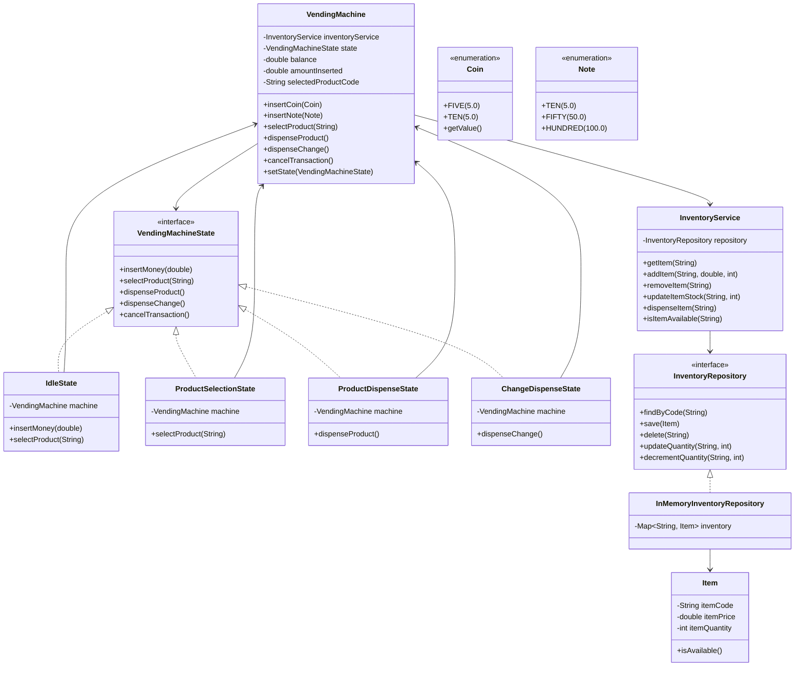

## Vending Machine 

### Requirements

1. The system should allow users to create accounts and manage their profile information.
2. Users should be able to create groups and add other users to the groups.
3. Users should be able to add expenses within a group, specifying the amount, description, and participants.
4. The system should automatically split the expenses among the participants based on their share.
5. Users should be able to view their individual balances with other users and settle up the balances.
6. The system should support different split methods, such as equal split, percentage split, and exact amounts.
7. Users should be able to view their transaction history and group expenses.
8. The system should handle concurrent transactions and ensure data consistency.

#### Core operations:

1. Manage users.
2. Manage user groups.
3. Add and track expense.
4. Expense should be split automatically.
5. Show balance for each user in individual groups.
6. Concurrency.

##### Other operations:

1. Different ways to split expenses.
2. Transaction history for each group and user.

### Class diagram

### Other considerations
1. Transaction service for auditing purpose
2. Separate validator methods
3. Builder pattern
4. Separate cash inventory for managing denominations and change validations
5. How would you add new payment methods? -> Use a paymentStrategy within Vending Machine
6. How would you handle concurrent access?
   1. Use ReentrantLocks (reads/write), wherever required.
   2. Use Concurrent collections, wherever required.
   3. For SQL based repositories, we need to use "FOR UPDATE" to atomically find and decrement the quantity.
      1. If "FOR UPDATE" starts, but we never actually update, the db automatically times out the lock.
   4. For DyanamoDB, we can use `@DynamoDBVersionAttribute -> Long version`
   5. Spring provides `@Transactional` for auto locking/unlocking.