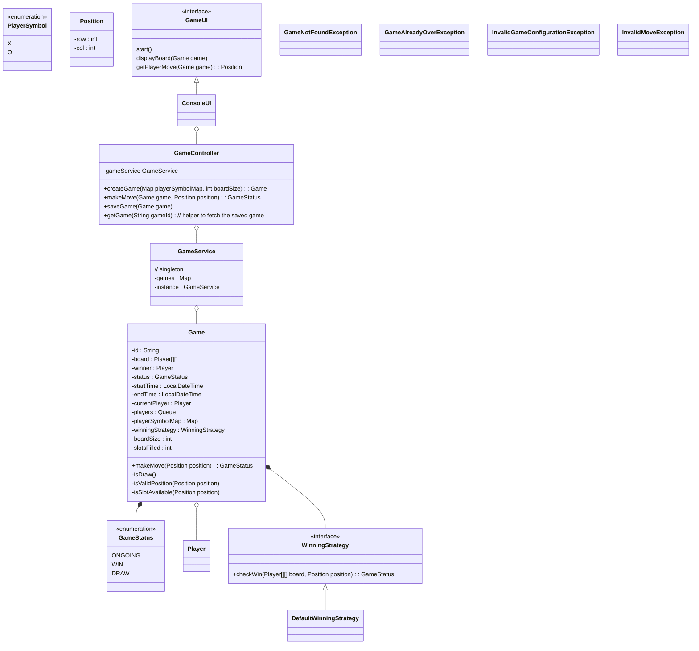

## TicTacToe Class Diagram



Other considerations:
1. Exception Handling
2. MoveHistory and Undo Support
```java
class Game {
    private Stack<Move> moveHistory;
    
    class Move {
        private Position position;
        private Player player;
        private LocalDateTime timestamp;
    }
    
    public boolean undoLastMove() {
        if (moveHistory.isEmpty()) return false;
        Move lastMove = moveHistory.pop();
        board[lastMove.position.getRow()][lastMove.position.getCol()] = null;
        currentPlayer = lastMove.player;
        slotsFilled--;
        return true;
    }
}
```
3. Observable Pattern for Game State Changes
```java
interface GameStateObserver {
    void onMoveMade(Move move);
    void onGameEnd(GameStatus status, Player winner);
}

class Game {
    private List<GameStateObserver> observers = new ArrayList<>();
    
    public void addObserver(GameStateObserver observer) {
        observers.add(observer);
    }
    
    private void notifyMoveMade(Move move) {
        observers.forEach(o -> o.onMoveMade(move));
    }
}
```
4. Input validation layer
5. Metrics collection (moves per game, win rates, etc.)
6. Game Save and Resume using Momento design pattern
