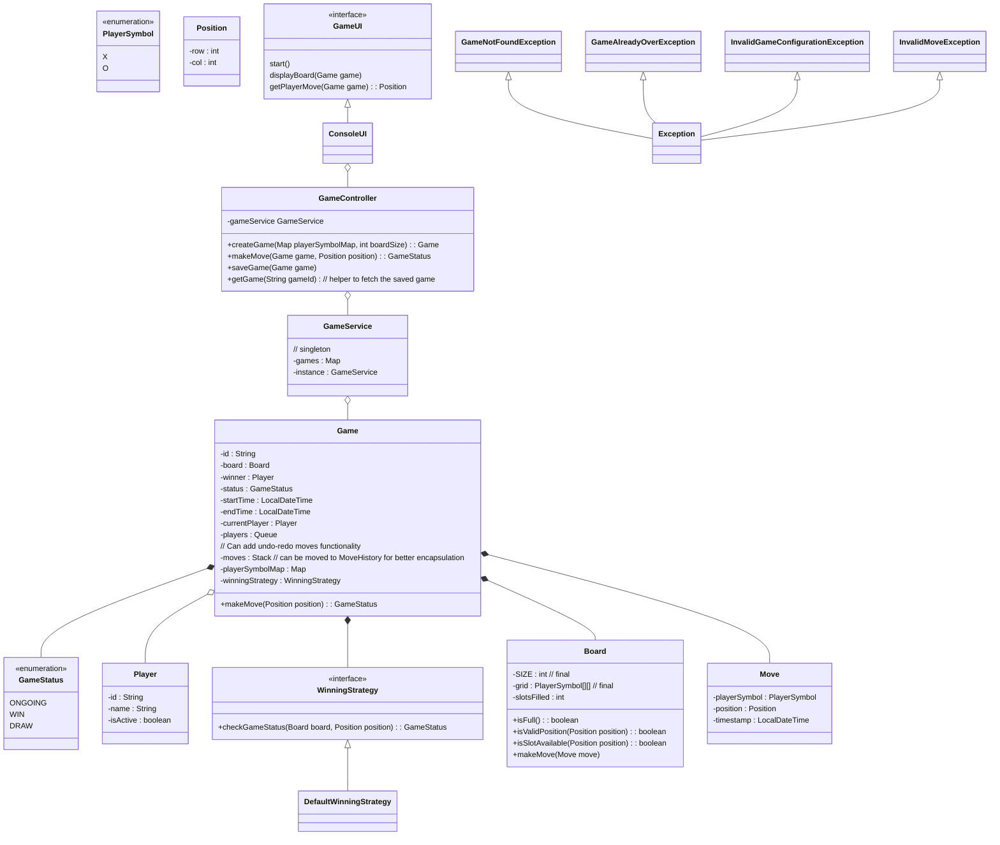

## TicTacToe Game

### Requirements

1. The Tic-Tac-Toe game should be played on a 3x3 grid.
2. Two players take turns marking their symbols (X or O) on the grid.
3. The first player to get three of their symbols in a row (horizontally, vertically, or diagonally) wins the game.
4. If all the cells on the grid are filled and no player has won, the game ends in a draw.
5. The game should have a user interface to display the grid and allow players to make their moves.
6. The game should handle player turns and validate moves to ensure they are legal.
7. The game should detect and announce the winner or a draw at the end of the game.

### Class Diagram



### Other considerations:
1. Exception Handling
2. MoveHistory and Undo Support
```java
class Game {
    private Stack<Move> moveHistory;
    
    class Move {
        private Position position;
        private Player player;
        private LocalDateTime timestamp;
    }
    
    public boolean undoLastMove() {
        if (moveHistory.isEmpty()) return false;
        Move lastMove = moveHistory.pop();
        board[lastMove.position.getRow()][lastMove.position.getCol()] = null;
        currentPlayer = lastMove.player;
        slotsFilled--;
        return true;
    }
}
```
3. Observable Pattern for Game State Changes
```java
interface GameStateObserver {
    void onMoveMade(Move move);
    void onGameEnd(GameStatus status, Player winner);
}

class Game {
    private List<GameStateObserver> observers = new ArrayList<>();
    
    public void addObserver(GameStateObserver observer) {
        observers.add(observer);
    }
    
    private void notifyMoveMade(Move move) {
        observers.forEach(o -> o.onMoveMade(move));
    }
}
```
4. Input validation layer
5. Metrics collection (moves per game, win rates, etc.)
6. Game Save and Resume using Momento design pattern
