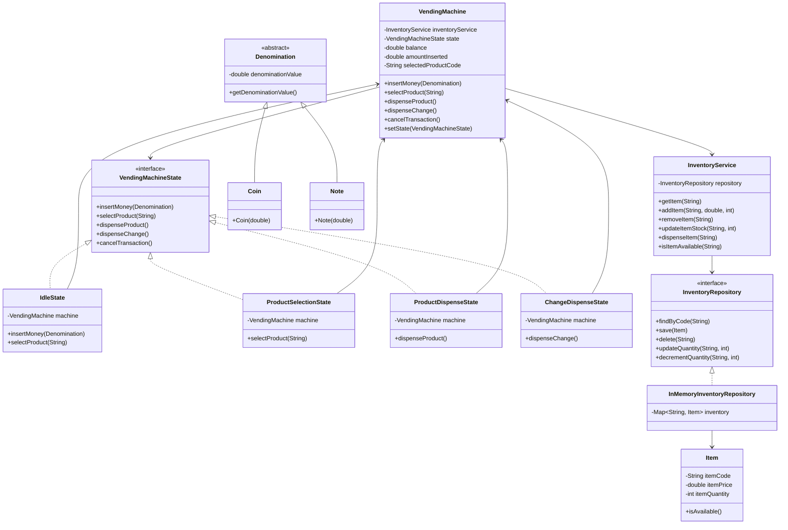

## Vending Machine 

### Requirements

The vending machine should maintain an inventory of products with their respective prices and quantities
Each product slot in the machine has a unique code (e.g., A1, A2, B1, B2)
The machine should accept different denominations of coins/notes (e.g., $1, $5, $10, $20)

#### Core operations:

1. Users can select a product using its code
2. Users can insert money
3. Machine should calculate remaining change
4. Machine should dispense the product
5. Machine should return change if necessary

#### Constraints:

1. If a product is out of stock, the machine should notify the user
2. If insufficient money is inserted, the machine should ask for more money or allow cancellation
3. If the machine cannot provide exact change, it should not proceed with the transaction
4. Support for canceling a transaction mid-way

##### Additional Features to Consider:

1. The machine should maintain a minimum amount of change
2. Mechanism to refill products and money
3. Basic maintenance operations (e.g., checking inventory, collecting money)
4. Error handling for:
   1. Invalid product selection 
   2. Machine out of change 
   3. Product stuck during dispensing 
   4. Invalid currency

### Class diagram

### Other considerations
1. Transaction service for auditing purpose
2. Separate validator methods
3. Builder pattern
4. Separate cash inventory for managing denominations and change validations
5. How would you add new payment methods? -> Use a paymentStrategy within Vending Machine
6. How would you handle concurrent access?
   1. Use ReentrantLocks (reads/write), wherever required.
   2. Use Concurrent collections, wherever required.
   3. For SQL based repositories, we need to use "FOR UPDATE" to atomically find and decrement the quantity.
      1. If "FOR UPDATE" starts, but we never actually update, the db automatically times out the lock.
   4. For DyanamoDB, we can use `@DynamoDBVersionAttribute -> Long version`
   5. Spring provides `@Transactional` for auto locking/unlocking.